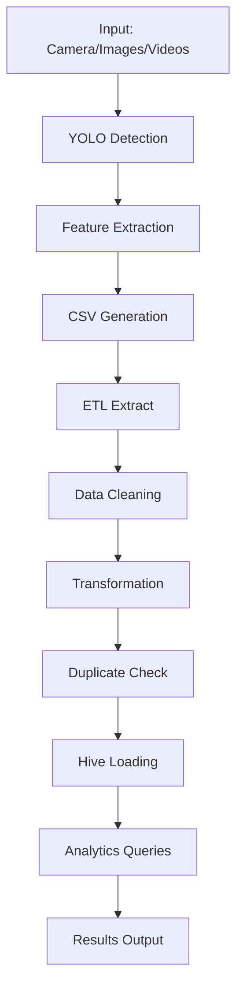

# AI Data Engineer Project

## 🎯 Descripción General

Este proyecto integra **Deep Learning**, **Visión por Computador** y **Procesamiento de Big Data** para crear un sistema completo de detección y análisis de objetos usando YOLO. La solución está compuesta por **dos sistemas independientes** que trabajan en conjunto:

### 🔍 Sistema de Clasificación (Computer Vision)
- Ejecuta detección de objetos YOLO sobre imágenes, videos y cámara en vivo
- Extrae atributos ricos de cada objeto detectado
- Genera archivos CSV locales como capa de staging

### 🔄 Sistema ETL Batch (Data Engineering)
- Procesa los CSV generados por el sistema de clasificación
- Realiza limpieza, transformación y validación de datos
- Carga datos a Apache Hive sin duplicados
- Ejecuta consultas analíticas sobre los datos

---

## 🏗️ Arquitectura del Proyecto

```
┌─────────────────────────────────────────────────────────────┐
│                    SISTEMA DE CLASIFICACIÓN                 │
├─────────────────────────────────────────────────────────────┤
│  📷 Entrada: Cámara/Imágenes/Videos                        │
│  🧠 YOLO Model (YOLOv8n)                                   │
│  📊 Extracción de Features                                  │
│  💾 Salida: CSV Files (data/output/)                       │
└─────────────────────────────────────────────────────────────┘
                               │
                               ▼
┌─────────────────────────────────────────────────────────────┐
│                      SISTEMA ETL BATCH                     │
├─────────────────────────────────────────────────────────────┤
│  📂 Extract: Lee CSV files                                  │
│  🧹 Transform: Limpieza + Feature Engineering              │
│  🏛️ Load: Apache Hive (sin duplicados)                     │
│  📈 Analytics: Consultas automáticas                       │
└─────────────────────────────────────────────────────────────┘
```

---

## 📁 Estructura del Proyecto

```
proyecto-AI-Data-Engineer/
├── main.py                     # Punto de entrada principal
├── requirements.txt            # Dependencias del proyecto
├── Makefile                   # Comandos de desarrollo
├── test/                      # Pruebas unitarias de diferentes puntos del proyecto
│
├── data/                      # Datos del proyecto
│   ├── input/
│   │   ├── images/           # Imágenes para procesamiento
│   │   └── videos/           # Videos para procesamiento
│   └── output/              # CSV generados por detecciones
│
├── models/
│   └── yolov8n.pt           # Modelo YOLO preentrenado
│
├── src/
│   ├── vision/              # Sistema de Clasificación
│   │   ├── __init__.py
│   │   ├── classification_system.py  # Punto de entrada
│   │   ├── media_io.py              # Manejo de medios
│   │   ├── model.py                 # Wrapper YOLO
│   │   ├── config.py                # Configuración
│   │   └── utils.py                 # Utilidades
│   │
│   ├── etl/                 # Sistema ETL
│   │   ├── __init__.py
│   │   ├── batch_etl_system.py     # Punto de entrada ETL
│   │   ├── etl.py                  # Lógica principal ETL
│   │   ├── warehouse.py            # Conexión a Hive
│   │   ├── config.py               # Configuración ETL
│   │   └── queries/                # Consultas SQL
│   │       ├── hive_schema.sql
│   │       ├── objects_per_class.sql
│   │       ├── people_per_video.sql
│   │       ├── bounding_box_mean_area_per_class.sql
│   │       ├── dominant_color_distrib.sql
│   │       ├── objects_per_time_window.sql
│   │       └── clear_table.sql
│ 
│ 
```

---

## 🔧 Módulos y Componentes

### 📷 Sistema de Clasificación (`src/vision/`)

#### `classification_system.py`
**Propósito:** Punto de entrada principal para el sistema de computer vision
- **Funciones principales:**
  - `run_classification_system(mode)`: Ejecuta detección según modo (camera/image/video)
- **Características:**
  - Maneja tres modos de operación
  - Guarda detecciones en CSV con timestamp único
  - Integra todos los componentes de visión

#### `media_io.py` 
**Propósito:** Manejo completo de entrada/salida de medios
- **Clases principales:**
  - `MediaIO`: Clase principal para procesamiento de medios
- **Funcionalidades:**
  - Captura de cámara con múltiples backends (V4L2, DSHOW)
  - Procesamiento de imágenes y videos
  - Diagnóstico automático de cámaras disponibles
  - Preview en tiempo real con detecciones
  - Acumulación de datos en DataFrame

#### `model.py`
**Propósito:** Wrapper para el modelo YOLO
- **Clases principales:**
  - `YoloModel`: Encapsula funcionalidad de YOLOv8
- **Características:**
  - Carga modelo YOLOv8n preentrenado
  - Filtra clases permitidas configurables
  - Inferencia optimizada sobre frames
  - Extracción de bounding boxes y confianza

#### `utils.py`
**Propósito:** Utilidades para procesamiento de datos y visualización
- **Funciones clave:**
  - `add_detection_to_dataframe()`: Agregar detecciones al DataFrame
  - `draw_multiple_detections()`: Visualización de bounding boxes
  - `extract_dominant_color()`: Análisis de color dominante
  - `get_position_region()`: Clasificación por región de posición
  - `create_detection_dataframe_schema()`: Esquema estándar de datos

#### `config.py`
**Propósito:** Configuración centralizada del sistema de visión
- **Configuraciones:**
  - Rutas de entrada para imágenes/videos
  - Parámetros de cámara (índice, resolución)
  - Clases YOLO permitidas (person, car, laptop, etc.)
  - Colores personalizados por clase de objeto

### 🔄 Sistema ETL (`src/etl/`)

#### `batch_etl_system.py`
**Propósito:** Punto de entrada del sistema ETL
- **Funciones:**
  - `run_batch_etl_system()`: Ejecuta pipeline completo ETL

#### `etl.py`
**Propósito:** Lógica principal del proceso ETL
- **Clases:**
  - `ETL`: Implementa patrón Extract-Transform-Load
- **Fases del proceso:**
  
  **Extract:**
  - Lee todos los CSV de `data/output/`
  - Combina múltiples archivos en un DataFrame único
  
  **Transform:**
  - Limpieza de valores nulos
  - Validación de coordenadas de bounding boxes
  - Filtrado por confianza mínima (0.5)
  - Detección y eliminación de duplicados
  - Normalización de datos
  - Casting de tipos de datos
  - Feature engineering (is_large_object, is_high_conf, time_window_10s)
  
  **Load:**
  - Inicialización de esquema Hive
  - Inserción sin duplicados
  - Ejecución de consultas analíticas

#### `warehouse.py`
**Propósito:** Gestión de conexión y operaciones con Apache Hive
- **Funciones principales:**
  - `get_hive_connection()`: Conexión a Hive
  - `init_hive_schema()`: Creación de base de datos y tablas
  - `filter_already_existing_detections()`: Prevención de duplicados
  - `insert_into_hive()`: Inserción por lotes optimizada
  - `run_hive_analytics()`: Ejecución de consultas analíticas
  - `clear_yolo_table()`: Limpieza de tabla (utilidad)

#### `queries/` (Consultas SQL)
**Propósito:** Consultas analíticas predefinidas
- **Consultas disponibles:**
  1. **objects_per_class.sql**: Conteo de objetos por clase
  2. **people_per_video.sql**: Número de personas detectadas por video
  3. **bounding_box_mean_area_per_class.sql**: Área promedio de bounding boxes por clase
  4. **dominant_color_distrib.sql**: Distribución de colores dominantes por clase
  5. **objects_per_time_window.sql**: Objetos detectados por ventana de 10 segundos

---

## 🗄️ Esquema de Base de Datos

### Tabla: `yolo_objects`

```sql
CREATE EXTERNAL TABLE yolo_objects (
  detection_id         STRING,    -- ID único de detección
  source_type          STRING,    -- Tipo: 'camera', 'image', 'video'
  source_id            STRING,    -- Nombre del archivo o 'live_camera'
  frame_number         INT,       -- Número de frame
  class_id             INT,       -- ID de clase YOLO
  class_name           STRING,    -- Nombre de clase ('person', 'car', etc.)
  confidence           DOUBLE,    -- Confianza de detección (0-1)
  
  -- Coordenadas del bounding box
  x_min                INT,
  y_min                INT,
  x_max                INT,
  y_max                INT,
  width                INT,
  height               INT,
  area_pixels          INT,
  
  -- Información del frame
  frame_width          INT,
  frame_height         INT,
  bbox_area_ratio      DOUBLE,    -- Proporción del bbox respecto al frame
  
  -- Centros y posición
  center_x             INT,
  center_y             INT,
  center_x_norm        DOUBLE,    -- Centro normalizado [0-1]
  center_y_norm        DOUBLE,
  position_region      STRING,    -- 'center', 'top-left', etc.
  
  -- Análisis de color
  dominant_color_name  STRING,    -- Color dominante del objeto
  dom_r                INT,       -- RGB del color dominante
  dom_g                INT,
  dom_b                INT,
  
  -- Metadatos temporales
  timestamp_sec        DOUBLE,    -- Timestamp Unix
  ingestion_date       TIMESTAMP, -- Fecha de ingesta
  
  -- Features derivados
  is_large_object      TINYINT,   -- 1 si área > 10000 px
  is_high_conf         TINYINT,   -- 1 si confianza > 0.8
  time_window_10s      INT        -- Ventana de 10 segundos
)
STORED AS PARQUET
LOCATION 'hdfs:///cursobsg/tables/yolo_objects';
```

---

## 🛠️ Tecnologías Utilizadas

### Computer Vision & ML
- **YOLOv8** (Ultralytics): Detección de objetos en tiempo real
- **OpenCV**: Procesamiento de imágenes y video
- **NumPy**: Operaciones numéricas eficientes

### Data Processing
- **Pandas**: Manipulación y análisis de datos
- **Apache Hive**: Data warehouse distribuido
- **PyHive**: Conector Python para Hive

### Development & Infrastructure  
- **Python 3.10**: Lenguaje principal
- **Black**: Formateo automático de código
- **Pylint**: Análisis estático de código
- **Pytest**: Framework de pruebas unitarias
- **Makefile**: Automatización de tareas

### Almacenamiento
- **HDFS**: Sistema de archivos distribuido
- **Parquet**: Formato columnar optimizado
- **CSV**: Formato de intercambio (staging)

---

## 🎨 Características Avanzadas

### 🔍 Feature Engineering Automático
- **Análisis de color dominante**: Extrae el color RGB más representativo
- **Clasificación por región**: Determina ubicación en el frame
- **Métricas derivadas**: Ratios de área, normalización de coordenadas
- **Ventanas temporales**: Agrupación por intervalos de 10 segundos

### 🚫 Prevención de Duplicados
- **ID único por detección**: Combinación de source + frame + bbox
- **Verificación en Hive**: Check antes de inserción
- **Procesamiento por lotes**: Optimización de inserción masiva

### 📊 Analytics Integradas
- **Consultas automáticas**: Se ejecutan después de cada carga
- **Visualización de resultados**: Output formateado en consola
- **Métricas de calidad**: Conteos, promedios y distribuciones

### 🎥 Multi-source Support
- **Cámara en vivo**: Detección en tiempo real
- **Procesamiento de imágenes**: Batch sobre directorio
- **Análisis de videos**: Frame por frame con tracking temporal

---

## 📈 Flujo de Datos



---

## 🔧 Configuración y Personalización

### Clases de Objetos Detectables
```python
ALLOWED_CLASSES = {
    "person", "car", "backpack", "bottle", "tv", 
    "laptop", "mouse", "remote", "keyboard", 
    "cell phone", "book", "toothbrush", "suitcase"
}
```

### Conexión a Hive
```python
HIVE_CONN_ARGS = {
    "host": "localhost",
    "port": 10000, 
    "username": "steph",
    "database": "yolo_db",
    "auth": "NONE"
}
```

### Parámetros de Procesamiento
- **Umbral de confianza**: 0.5 (configurable)
- **Tamaño de lote**: 200 detecciones por inserción, subdivisiones a partir de ventanas de tiempo de 10 segundos.
- **Resolución de cámara**: 640x480 (configurable)

---

## 🔄 Pipeline de Desarrollo

El proyecto sigue buenas prácticas de ingeniería de software:

- **Entorno virtual**: Aislamiento de dependencias
- **Linting automático**: Código consistente y limpio  
- **Formateo con Black**: Estilo de código unificado
- **Pruebas unitarias**: Validación de funcionalidad
- **Documentación**: README y guías completas
- **Control de versiones**: Git con estructura clara